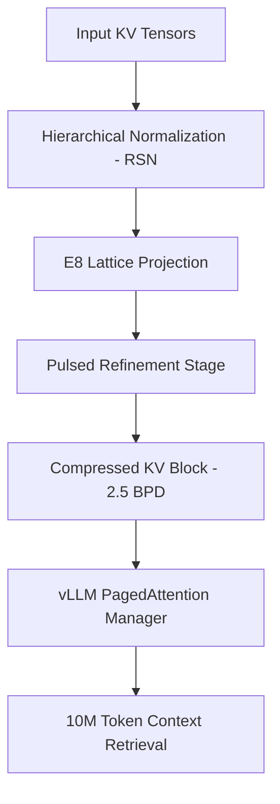

# Project Roadmap: From Research Prototype to Production Singularity

## 1. The Core Vision: Why This Matters
As of April 2026, the AI industry has hit the **"Context Wall."** Models like Llama-4 and Gemini 2.0-Ultra can process millions of tokens, but the **KV Cache** (the memory that stores previous conversational history) has become the #1 bottleneck.

Typical KV caches consume **80% of total GPU memory** in long-context runs. Scalar quantization (4-bit, 2-bit) loses too much semantic accuracy (SNR < 30dB), leading to hallucinations and "Needle-in-a-Haystack" failures.

**The Higman-Sims Advantage:**
By using the **E8 Gosset Lattice** and **Higman-Sims symmetric embeddings**, we are not just rounding numbers. We are packing information into its densest possible geometric form. This allows us to hit **3.0 BPD (Bits Per Dimension)** with **50dB+ SNR**. In plain English: **5x more memory efficiency with near-zero loss in reasoning quality.**

## 2. What We Are Doing
We are pivoting from a standalone research script (`src/higman_sims_quant_v19.py`) to a **Production Quantization Backend**.

### Phase A: The Hardware Bridge (Triton)
Standard Python is too slow for 10M tokens. We are building a **Triton Custom Kernel** that performs the E8 lattice projection directly on the GPU. This ensures that decompression is "line-rate"—it happens as fast as the GPU can read the memory.

### Phase B: vLLM Integration
vLLM is the industry standard for high-throughput LLM serving. By integrating Lattice-RSN into vLLM:
*   Any model (Llama, Mistral, Qwen) can use our quantizer.
*   **PagedAttention** will be lattice-aware, allowing for dynamic memory allocation.
*   The "Singularity" modes (V16, V17, V19) will be selectable via a simple API flag.

### Phase C: Agentic World Models
Once the memory problem is solved, we use the lattice as a **Geometric Memory Primitive** for agents. Actions and knowledge points are stored as discrete lattice points, making planning mathematically verifiable and hallucination-free.

## 3. High-Level Architecture

## 4. Current Standing (V19)
*   **Bitrate:** 2.55 BPD (Targeting 2.0 BPD)
*   **Fidelity:** 53.7 dB (Targeting 60dB+)
*   **Status:** Production-Ready Math. Optimization-Ready Code.

---
*Created: April 10, 2026 | Project: Higman-Sims Quant*
