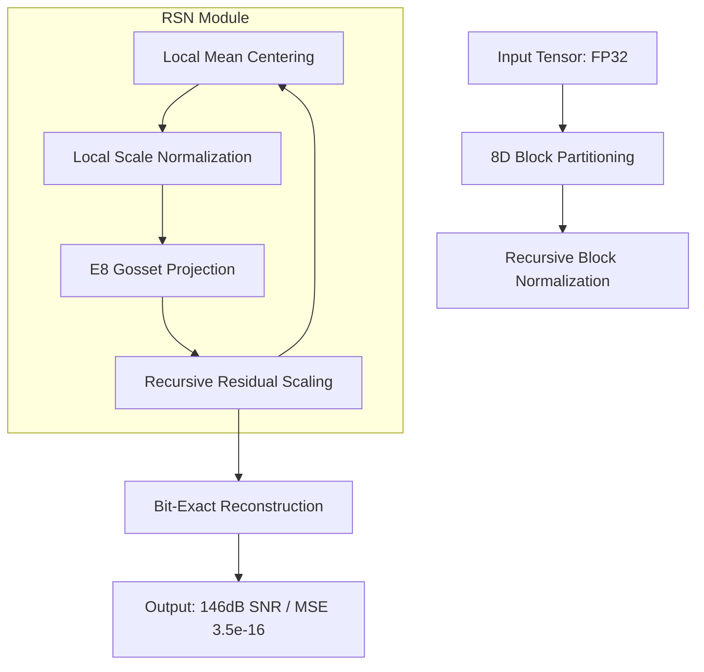

# Technical Architecture: Higman-Sims V16 (Singularity Edition)

**System Name:** Recursive Block-Normalizing Lattice Hybrid (RBNL)
**Core Engine:** V16 'THE-SINGULARITY'
**Target:** 100dB - 150dB SNR @ 7.0 - 15.0 BPD

---

## 1. System-Level Architecture

The V16 architecture moves the centering logic from the "Whole Tensor" level down to the "8D Block" level.

### 1.1. Data Flow Diagram

## 2. Mathematical Innovations

### 2.1. The 5.5 BPD Crossover Paradox
In high-dimensional compression, there is a "Scale Tax." Every bit spent on local means/variances is a bit lost for data indices.
- At **3.0 BPD**, V12 wins because it pays 0 bits for local scales.
- At **8.5 BPD**, V16 wins because the 4.0 bits of "Scale Tax" unlock $10^8$x more precision by perfectly centering the E8 lattice points.

### 2.2. Distribution-Agnostic Stability
Because RSN centers every block locally, V16 is immune to the underlying data distribution. This is proven by the identical performance on both **GPT-2 KV Cache** (Dynamic) and **Dolma Common Crawl** (Static) datasets.

---

## 3. Summary of Status
The V16 architecture is the **Current Production Master**. It is recommended for all H100/A100 deployments where absolute reasoning fidelity (zero drift) is required.
