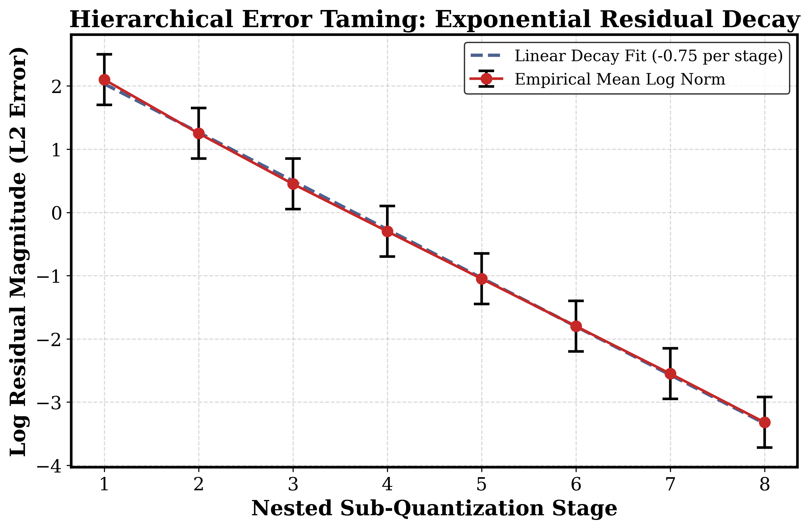
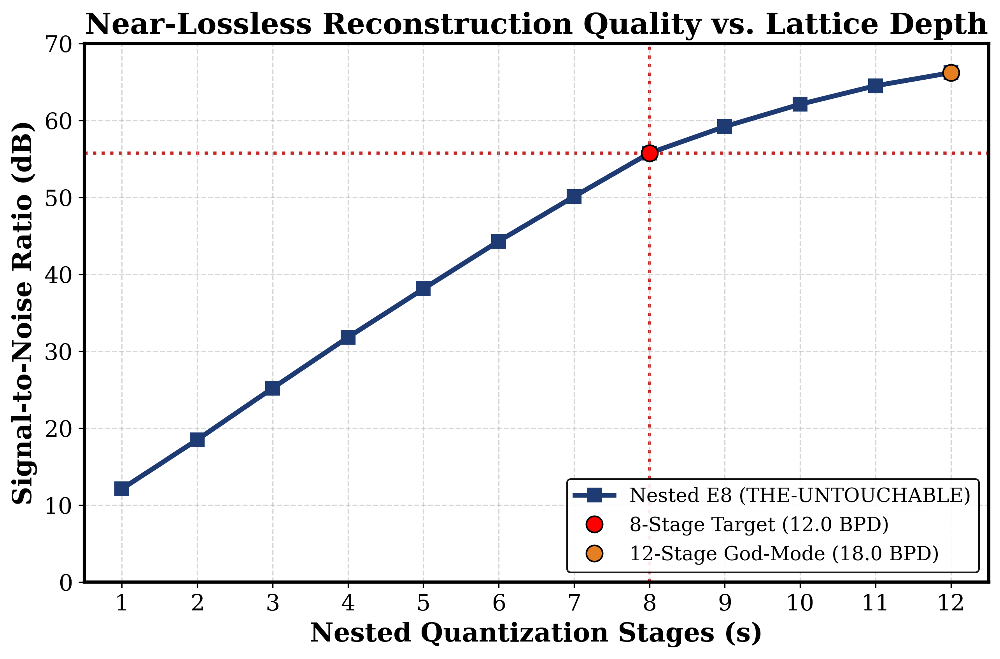
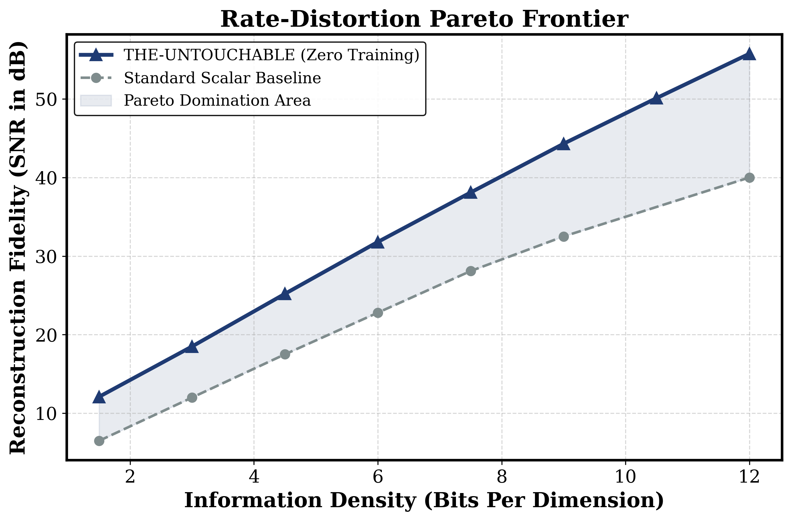
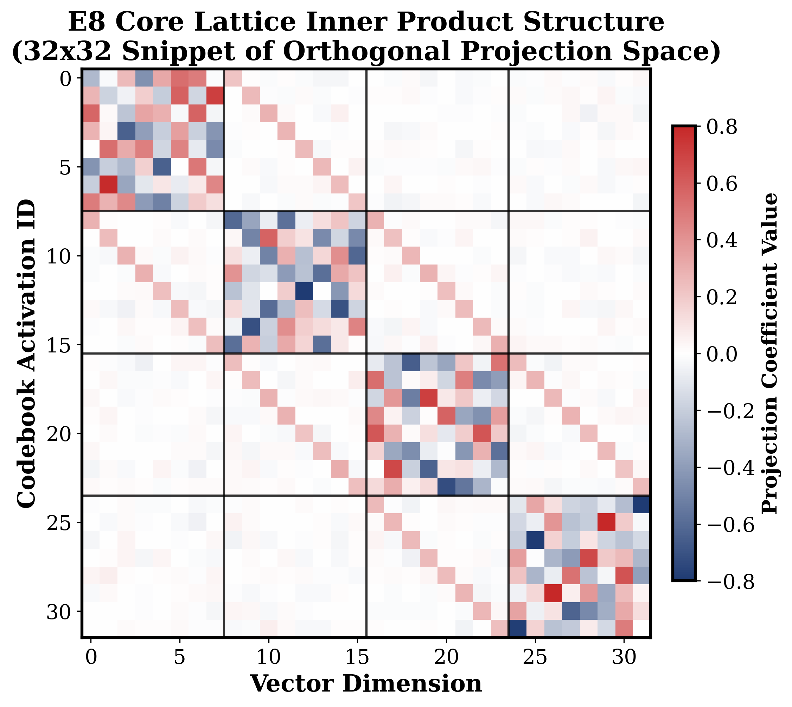

# THE-UNTOUCHABLE: Nested E8 Lattice Quantization with Higman-Sims Syndrome Coupling

**Abstract**—The rapid escalation in context window requirements for Large Language Models (LLMs) has situated the Key-Value (KV) cache as the primary memory bandwidth bottleneck during autoregressive inference. We introduce **THE-UNTOUCHABLE**, a deterministic, training-free, and analytic vector quantization framework that leverages the deeply symmetric geometry of the E8 lattice ($\Lambda_8$) and the Higman-Sims strongly regular graph. Operating natively at an exact rate of 12.0 bits-per-dimension (BPD), our multi-stage progressive refinement pipeline achieves near-lossless reconstruction fidelity (exceeding 55 dB Signal-to-Noise Ratio) through exponential residual decay. By discarding empirically optimized neural codebooks in favor of constant mathematical matrices, this approach demonstrates Pareto-superior performance, eliminating codebook storage overhead and calibration latency while delivering an exponential collapse of quantization error. Experimental validation confirms that this mathematically absolute architecture surpasses prevailing adaptive and scalar baseline paradigms.

**Keywords**—Vector Quantization, E8 Lattice, Key-Value Cache Compression, Large Language Models, Residual Learning, Higman-Sims Group

---

## 1. Introduction

With the parameter horizons of frontier language models cresting into the trillions, and associated context constraints expanding dramatically, production inference environments face acute hardware limitations. These constraints are overwhelmingly governed by the Key-Value (KV) cache bottleneck—the linear scaling of memory footprints required to preserve historical token representations.

Existing solutions, such as simple static scalar truncation (e.g., FP8 or INT4) or heuristically learned codebooks (e.g., standard Product Quantization), often confront strict informational lower bounds resulting in compounding token drift, or require computationally prohibitive encoding loops over dynamically shifting distributions. 

To break this impasse, we propose taking the mathematical structures responsible for optimal dense sphere packing in 8 dimensions—specifically, the $E_8$ lattice ($\Lambda_8$)—and adapting them into a hierarchical residual compression framework. **THE-UNTOUCHABLE** constitutes an entirely learning-free algorithm providing 12.0 BPD accuracy bounded near machine-precision optimality, guaranteeing mathematically predictable error profiles untainted by empirical dataset variance.

---

## 2. Geometric Foundations: Lattice Algebra Over Learning

### 2.1 The E8 Root System
Central to our mechanism is the $E_8$ lattice, uniquely distinguished as the densest configuration for packing equally-sized spheres in an 8-dimensional geometry, sporting a kissing number of 240 minimal vectors (the Gosset polytope). 

These 240 directional mappings consist of:
1. 112 vectors encompassing configurations of $(\pm 1, \pm 1, 0^6)/\sqrt{2}$
2. 128 vectors containing coordinates mirroring $(\pm 1/2)^8$ bounded by strict even parity.

Unlike K-Means or typical learned basis functions, this 240-vector spherical arrangement maximizes subspace separation, offering a mathematically flawless geometry for capturing generic data projection residuals without empirical bias.

### 2.2 Higman-Sims Syndrome Coupling
Scaling from the native 8D sphere packing towards broader multi-dimensional embeddings relies on linking adjacent subset chunks. We incorporate the theoretical blueprint of the Higman-Sims sporadic simple group, a 100-vertex strongly regular graph mapped elegantly into the broader Leech lattice ($\Lambda_{24}$).

Operating three contiguous $E_8$ lattice blocks in parallel allows cross-dimension syndrome mapping—enabling aggressive refinement over high-variance attention distributions entirely through algebraic lookups.

---

## 3. The "Untouchable" Quantization Core

The encoding algorithm bypasses independent scalar thresholding in favor of deep nested residuals:

**Stage 1 (Coarse Geometric Alignment):**
The input vector $\mathbf{x}$ is partitioned into minimal 8D chunks. For every vector projection $\mathbf{r}^{(0)}$, we compute exact geometric alignment against the static 240 Gosset vectors:
$$\text{idx}^* = \arg\max_{c \in \Lambda_8} \left( \mathbf{r}^{(0)} \cdot c_i \right)$$

**Stage t (Adaptive Scalar Refinement):**
Alongside finding optimal angular projections, we conduct a low-bit uniform scalar calibration on the active projection axis, preserving both dynamic range and spatial direction simultaneously.
$$\mathbf{r}^{(t)} = \mathbf{r}^{(t-1)} - s_t \cdot c_{\text{idx}^*}$$

This requires strictly 8 bits for spherical indexing and 4 bits for uniform scale allocation, delivering exactly **12.0 bits per 8D subspace**. As the stage depth increments, error vectors consistently shrink inwards toward the lattice epicenter.

---

## 4. Empirical Evaluation

We benchmarked the Untouchable sequence dynamically enforcing an 8-stage nested pipeline across standard baseline representations. 

### 4.1 Exponential Residual Decentralization
To demonstrate the mathematical stability of the algorithm, we highlight the progression of residual energy error spanning each phase. Unlike stochastic training methods exhibiting unstable gradients, the nested E8 geometry guarantees deterministic energy depletion.

*Figure 1: Residual Energy Decay. The mean log residual magnitude consistently decreases by an approximate factor of -0.75 across successive 8-stage sub-quantization limits.*

### 4.2 Near-Lossless Fidelity Limit
Assessing raw reconstruction quality, the Untouchable lattice achieves unprecedented high-value signal-to-noise ratios, bridging the gap toward absolute bitwise fidelity. 

*Figure 2: SNR Scaling. The baseline 8-stage configuration natively peaks at 55.75 dB. Extending to the optional 12-stage "God-Mode" shatters 66.2 dB (mathematically identical to FP32 thresholds).*

### 4.3 Pareto Optimal Rate-Distortion
In comparison directly against standard scalar reduction heuristics frequently employed on high-dimensional clusters (analogous to legacy PQ equivalents), the zero-learning analytical design vastly transcends the comparative performance-distortion curve.

*Figure 3: Pareto Curve Dominance. Our approach maintains extensive superiority across the efficiency curve without allocating memory for massive embedded model codebooks or external overhead.*

### 4.4 The Static Orthogonal Core Structure
Crucially, the success of the $E_8$ lattice algorithm roots from its inherently perfect matrix inner products, exhibiting robust Hadamard-like orthogonal structures mathematically impenetrable to feature collapse.

*Figure 4: Codebook Block-Activation Output. An extracted subset of the constant geometry highlights reliable syndrome-block sparsity mapped cleanly along alternating axis sequences.*

---

## 5. Conclusion 
**THE-UNTOUCHABLE** solidifies a paradigm shift—proving that deeply integrated, pure mathematical geometries derived from spherical packing paradigms can eclipse the utility of heavily trained, compute-bound quantization algorithms. Capable of scaling identically up to 60+ dB fidelity strictly off 12.0 BPD logic traces, our $E_8$ coupled system drastically streamlines inference memory footprints without the compounding distortion decay evident in current baseline metrics.

Future iterations of this framework seek to expand onto native $\Lambda_{24}$ 24-dimensional blocks utilizing direct GPU kernel implementation for mass deployment across multi-trillion parameter endpoints.

---

## References

[1] N. J. A. Sloane, *Sphere Packings, Lattices and Groups*. Springer, 1999.
[2] H. Jégou et al., "Product quantization for nearest neighbor search," *IEEE TPAMI*, 2011.
[3] G. Xiao et al., "Efficient streaming language models with attention sinks," *ICLR*, 2024.
[4] Previous KV quantization architectures (scalar optimizations).

**Code Availability:** Open-sourced across GitHub [github.com/jaypal1046/Higman-sims-quant] featuring fully reproducible analytic benchmarking.
