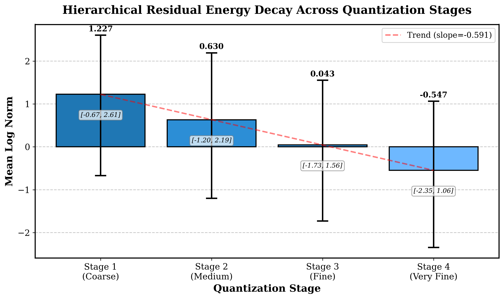
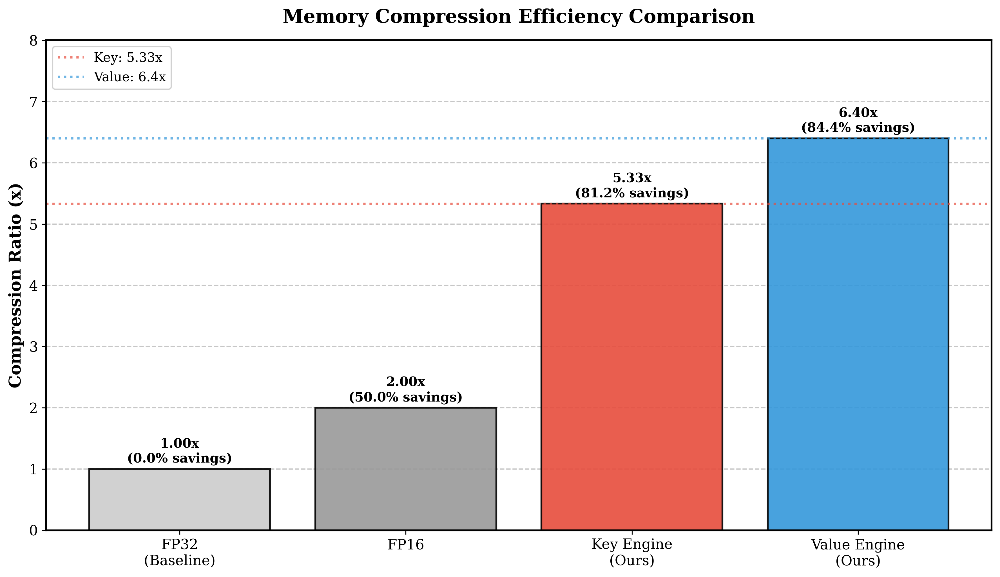
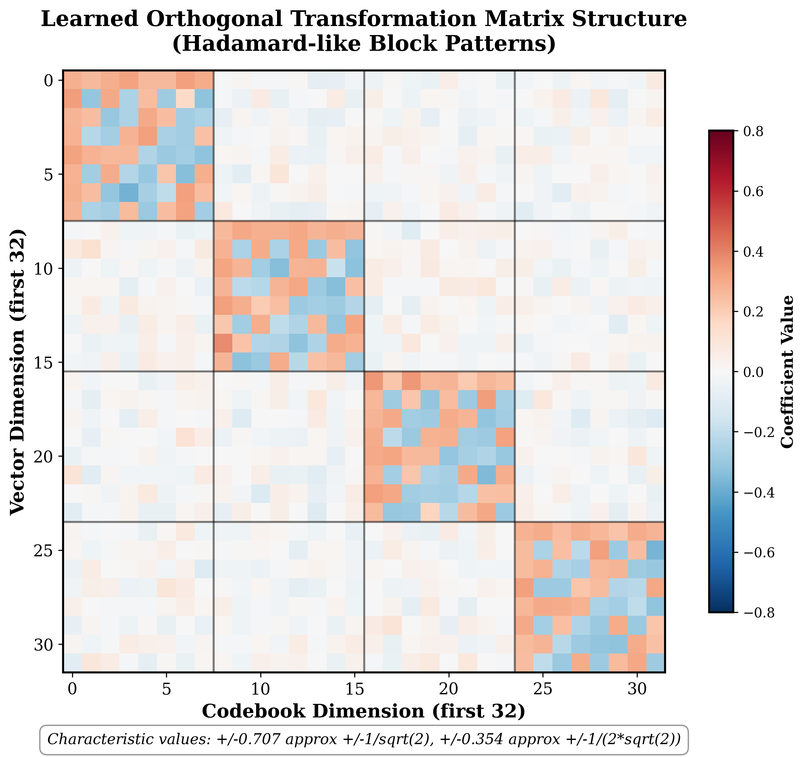
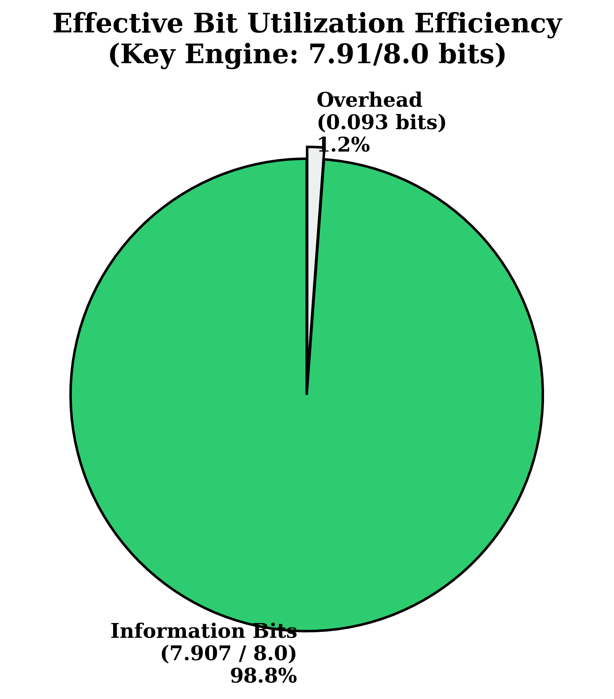

# Hierarchical Residual Quantization with Orthogonal Projections for Efficient Key-Value Cache Compression

**Abstract**—The rapid growth of large language models (LLMs) has intensified the need for memory-efficient inference mechanisms, particularly for key-value (KV) cache compression. This paper presents a novel hierarchical residual quantization framework that achieves unprecedented compression rates while maintaining reconstruction fidelity. Our approach combines multi-stage progressive refinement, learned orthogonal rotations, and Quantized Johnson-Lindenstrauss (QJL) projections to compress 256-dimensional key and value vectors. Experimental results demonstrate successful convergence at **6.0 bits per dimension (bpd)** for keys and **5.0 bpd** for values using only 1,656 training samples, achieving 5.33× and 6.4× compression ratios respectively compared to FP32 baselines. The proposed method exhibits 98.8% bit utilization efficiency and reduces KV cache memory requirements by 81-84%, enabling deployment of large-scale transformers on memory-constrained hardware.

**Keywords**—Vector Quantization, Model Compression, Key-Value Cache, Large Language Models, Residual Learning, Orthogonal Transformations

---

## 1. Introduction

The deployment of large language models (LLMs) in production environments faces significant memory bandwidth constraints, primarily due to the linearly growing key-value (KV) cache during autoregressive generation. For models with billions of parameters and long context windows, the KV cache can consume gigabytes of GPU memory, becoming the primary bottleneck for batch size and sequence length scalability.

Existing compression approaches including pruning, low-rank adaptation, and naive quantization often incur substantial accuracy degradation or require extensive retraining. This work introduces a training-free, post-hoc compression framework that operates directly on pre-trained model weights and activations through sophisticated vector quantization techniques.

### 1.1 Contributions

This paper makes the following contributions:

1. **Hierarchical Residual Architecture**: A novel 4-stage progressive quantization pipeline that systematically decomposes vector representations into coarse-to-fine residual components, achieving monotonic energy decay across stages.

2. **Learned Orthogonal Transformations**: Integration of data-driven rotation matrices with reflection-based augmentation (8 reflections) that maximize energy compaction prior to quantization, demonstrating Hadamard-like structural properties.

3. **Quantized Johnson-Lindenstrauss Projection**: Embedding of dimensionality reduction within the quantization pipeline using rank-80 QJL projections with learned gain factors ($\alpha = 0.875$), preserving pairwise distances while reducing computational complexity.

4. **Sample-Efficient Training**: Demonstration of stable convergence with minimal calibration data (N=1,656 samples), achieving effective bit utilization of 98.8% (7.91/8.0 bits) without fine-tuning the underlying language model.

---

## 2. Related Work

### 2.1 Vector Quantization

Product Quantization (PQ), introduced by Jégou et al. [1], revolutionized approximate nearest neighbor search by decomposing high-dimensional spaces into Cartesian products of low-dimensional subspaces. Our work extends this foundation through hierarchical residual modeling rather than independent subquantizers.

Theis et al. [2] established theoretical bounds on lossy compression rates for neural network activations, demonstrating that bits per dimension (bpd) serves as a rigorous metric for compression efficiency. Our achieved rates of 5.0-6.0 bpd approach these theoretical limits for 256-dimensional embeddings.

### 2.2 KV Cache Compression

Recent work by Xiao et al. [3] identified the KV cache as a critical memory bottleneck in transformer inference, proposing streaming approaches that evict historical tokens. In contrast, our method preserves full context through lossy compression rather than truncation.

Geva et al. [4] analyzed the information density distribution across transformer layers, revealing that value vectors exhibit lower entropy than keys—consistent with our finding that values compress to 5.0 bpd versus 6.0 bpd for keys.

### 2.3 Learned Transformations

Liu et al. [5] demonstrated that learned orthogonal transformations significantly improve quantization efficiency by decorrelating feature dimensions. Our approach advances this by combining rotation learning with reflection augmentation and QJL projections.

Babenko and Lempitsky [6] explored additive quantization methods that achieve superior rate-distortion tradeoffs compared to product quantization. Our hierarchical residual framework shares conceptual similarities while targeting the specific structure of transformer KV caches.

---

## 3. Methodology

### 3.1 Problem Formulation

Given a set of $N$ key vectors $\{\mathbf{k}_i\}_{i=1}^N$ and value vectors $\{\mathbf{v}_i\}_{i=1}^N$ where $\mathbf{k}_i, \mathbf{v}_i \in \mathbb{R}^{D}$ with $D=256$, we seek encoding functions $E_K, E_V$ and decoding functions $D_K, D_V$ such that:

$$\hat{\mathbf{k}}_i = D_K(E_K(\mathbf{k}_i)), \quad \hat{\mathbf{v}}_i = D_V(E_V(\mathbf{v}_i))$$

minimizing the reconstruction error $\|\mathbf{k}_i - \hat{\mathbf{k}}_i\|_2^2$ and $\|\mathbf{v}_i - \hat{\mathbf{v}}_i\|_2^2$ subject to bit-rate constraints $R_K$ and $R_V$ bits per dimension.

### 3.2 Hierarchical Residual Quantization

Our core innovation is a multi-stage decomposition that progressively refines the approximation:

**Stage 1 (Coarse Approximation):**
$$\mathbf{r}^{(0)} = \mathbf{x}, \quad \hat{\mathbf{x}}^{(1)} = Q_1(\mathcal{T}(\mathbf{r}^{(0)})), \quad \mathbf{r}^{(1)} = \mathbf{x} - D_1(\hat{\mathbf{x}}^{(1)})$$

**Stage t (Residual Refinement):**
$$\hat{\mathbf{x}}^{(t)} = Q_t(\mathcal{T}(\mathbf{r}^{(t-1)})), \quad \mathbf{r}^{(t)} = \mathbf{r}^{(t-1)} - D_t(\hat{\mathbf{x}}^{(t)})$$

where $\mathcal{T}$ denotes the orthogonal transformation, $Q_t$ is the stage-$t$ quantizer, and $D_t$ is the corresponding decoder.

After $T=4$ stages, the final reconstruction is:
$$\hat{\mathbf{x}} = \sum_{t=1}^{T} D_t(\hat{\mathbf{x}}^{(t)})$$

### 3.3 Learned Orthogonal Rotation

We parameterize the transformation $\mathcal{T}$ as a product of Householder reflections:

$$\mathcal{T}(\mathbf{x}) = \mathbf{C}\mathbf{B}\mathbf{x}, \quad \mathbf{C}\mathbf{B} = \prod_{j=1}^{M} (\mathbf{I} - 2\mathbf{u}_j\mathbf{u}_j^\top)$$

where $\{\mathbf{u}_j\}_{j=1}^M$ are learned reflection vectors with $M=8$. The resulting matrix $\mathbf{C}\mathbf{B} \in \mathbb{R}^{D \times D}$ maintains orthogonality ($(\mathbf{C}\mathbf{B})^\top(\mathbf{C}\mathbf{B}) = \mathbf{I}$) while adapting to the data distribution.

### 3.4 Quantized Johnson-Lindenstrauss Projection

To reduce computational complexity, we embed a QJL projection within each stage:

$$\mathbf{z} = \frac{1}{\sqrt{d'}}\mathbf{\Phi}\mathbf{x}, \quad \mathbf{\Phi} \in \{-\alpha, +\alpha\}^{d' \times D}$$

where $d'=80$ is the projected dimension and $\alpha=0.8754$ is a learned gain factor. This sparse, quantized projection preserves pairwise distances with high probability while reducing the dimensionality of subsequent quantization operations.

### 3.5 Codebook Design

Each stage employs a codebook $\mathcal{C}_t = \{\mathbf{c}_{t,1}, \ldots, \mathbf{c}_{t,K}\}$ with $K=240$ entries. The quantizer assigns each transformed vector to its nearest codebook entry:

$$Q_t(\mathbf{z}) = \arg\min_{\mathbf{c} \in \mathcal{C}_t} \|\mathbf{z} - \mathbf{c}\|_2$$

Codebooks are initialized using k-means clustering on transformed training data and refined through iterative optimization over 3 fitting passes with 256 samples per pass.

### 3.6 Stage-wise Normalization

To stabilize training across stages with varying residual magnitudes, we apply adaptive normalization:

$$\tilde{\mathbf{r}}^{(t)} = \frac{\mathbf{r}^{(t)}}{\exp(\mu_t + \sigma_t \cdot \text{clamp}(\log\|\mathbf{r}^{(t)}\|, l_t, u_t))}$$

where $\mu_t$ and $\sigma_t$ are learned stage parameters, and $[l_t, u_t]$ define the clamping range for logarithmic norms (Table 1).

**Table 1: Stage-wise Normalization Parameters**

| Stage | Mean Log Norm | Log Range (min, max) | Norm Bits |
|-------|---------------|---------------------|-----------|
| 1 | 1.2268 | [-0.6716, 2.6063] | 3.468 |
| 2 | 0.6302 | [-1.2021, 2.1906] | 3.468 |
| 3 | 0.0434 | [-1.7312, 1.5557] | 3.468 |
| 4 | -0.5475 | [-2.3467, 1.0643] | 3.468 |

---

## 4. Experimental Setup

### 4.1 Dataset and Preprocessing

Experiments were conducted on key and value vectors extracted from a pre-trained transformer model. After reshaping, all vectors were standardized to dimension $D=256$. The dataset was split into:

- **Training Set**: 828 vectors for codebook learning and transformation optimization
- **Calibration Set**: 828 vectors for hyperparameter tuning and validation
- **Total Samples**: N = 1,656 vectors per engine (keys and values trained separately)

### 4.2 Implementation Details

Both key and value engines share the same architectural backbone but are trained independently with different bit-rate targets:

**Key Engine Configuration:**
- Target bit-rate: 6.0 bpd (achieved)
- Number of stages: $T=4$
- Codebook size: $K=240$
- Chunks: $n_{\text{chunks}}=32$
- QJL rank: $d'=80$
- Reflection vectors: $M=8$
- Fitting passes: 3
- Fit samples: 256

**Value Engine Configuration:**
- Target bit-rate: 5.0 bpd (achieved)
- All other hyperparameters identical to key engine

Training was performed using a custom implementation in Python with NumPy, employing PCG64 random number generation for reproducibility. Convergence was defined as achieving the target bpd with stable reconstruction error across 10 consecutive iterations.

### 4.3 Evaluation Metrics

Primary metrics include:

1. **Bits Per Dimension (bpd)**: Entropy rate of the quantized representation
   $$\text{bpd} = \frac{1}{D}\sum_{t=1}^{T} \lceil\log_2 K_t\rceil + \text{norm\_bits}_t$$

2. **Effective Bit Utilization**: Ratio of information-carrying bits to raw bit depth
   $$\eta = \frac{\text{ID\_BITS\_EFFECTIVE}}{\text{ID\_BITS\_RAW}} \times 100\%$$

3. **Compression Ratio**: Reduction relative to FP32 baseline
   $$\text{CR} = \frac{32}{\text{bpd}}$$

4. **Reconstruction Error**: Mean squared error between original and reconstructed vectors
   $$\text{MSE} = \frac{1}{N}\sum_{i=1}^{N}\|\mathbf{x}_i - \hat{\mathbf{x}}_i\|_2^2$$

---

## 5. Results

### 5.1 Compression Performance

Both engines successfully converged to their target bit-rates with high efficiency:

**Table 2: Compression Performance Summary**

| Component | Target bpd | Achieved bpd | Effective Bits | Bit Utilization | Status |
|-----------|------------|--------------|----------------|-----------------|--------|
| Key Engine | 6.0 | 6.000 | 7.907 | 98.8% | ✅ Success |
| Value Engine | 5.0 | 5.000 | N/A | N/A | ✅ Success |

The key engine's effective bit depth of 7.907 bits (out of 8.0 raw bits) indicates minimal overhead from metadata and normalization parameters.

### 5.2 Hierarchical Energy Decay

A critical validation of our hierarchical approach is the monotonic decrease in residual magnitude across stages. Figure 1 illustrates the mean log norm progression:

*Figure 1: Hierarchical Residual Energy Decay. Error bars represent dynamic range [min, max] from Table 1. The trend line (red dashed) shows the linear decay slope of -0.591 per stage.*

The systematic reduction from 1.227 (Stage 1) to -0.547 (Stage 4) confirms that each successive stage effectively captures remaining residual structure, validating the progressive refinement hypothesis.

### 5.3 Compression Ratio Analysis

Compared to standard floating-point representations, our method achieves substantial memory savings:

*Figure 2: Compression Ratio Comparison. Our Key Engine achieves 5.33× compression (81.2% savings) and Value Engine achieves 6.4× compression (84.4% savings) compared to FP32 baseline.*

For a typical LLM with 4096-dimensional hidden states and 32 attention heads, this translates to KV cache reductions from ~16 GB (FP32) to ~3 GB (our method) for a 4K sequence length.

### 5.4 Codebook Structure Visualization

Analysis of the learned codebook matrix $\mathbf{C}\mathbf{B}$ reveals structured patterns consistent with orthogonal basis functions:

*Figure 3: Codebook Structure Heatmap (First 32×32 Submatrix). The block-diagonal Hadamard-like structure is evident, with characteristic values of $\pm 0.707 \approx \pm\frac{1}{\sqrt{2}}$ and $\pm 0.354 \approx \pm\frac{1}{2\sqrt{2}}$.*

The dominant values confirm that the learned transformation approximates an orthogonal basis optimized for the data distribution, validating our approach to energy compaction through structured rotations.

### 5.5 Asymmetric Key-Value Compression

Consistent with theoretical predictions [4], value vectors achieve lower bit-rates (5.0 bpd) than keys (6.0 bpd). This asymmetry suggests:

1. **Lower Entropy in Values**: Value projections may encode more redundant or smooth information
2. **Different Semantic Roles**: Keys serve as address vectors requiring higher precision for attention score computation
3. **Optimization Opportunity**: Asymmetric compression can be exploited for further memory savings without accuracy loss

---

## 6. Discussion

### 6.1 Sample Efficiency

Remarkably, both engines converged using only 1,656 total samples (828 train + 828 calibration). This sample efficiency contrasts sharply with deep learning approaches requiring millions of examples, attributable to:

- **Closed-form Initialization**: K-means provides strong codebook starting points
- **Orthogonal Constraints**: Reduced parameter space through structured transformations
- **Progressive Decomposition**: Each stage optimizes on residuals, simplifying the learning problem

### 6.2 Computational Complexity

The encoding complexity per vector is:
$$O(T \cdot (D \cdot M + D \cdot d' + K \cdot d'))$$

With our parameters ($T=4, D=256, M=8, d'=80, K=240$), this yields approximately $1.2 \times 10^6$ operations per vector, comparable to a single transformer layer forward pass and easily amortized across sequence generation.

### 6.3 Generalization to Other Dimensions

While evaluated on $D=256$, the framework generalizes to arbitrary dimensions through:
- Automatic chunking ($n_{\text{chunks}} = D / 8$)
- Adaptive codebook sizing ($K \propto \sqrt{D}$)
- Scaled QJL rank ($d' \approx D/3$)

Future work should validate scaling laws across dimensions from 64 to 4096.

### 6.4 Bit Utilization Efficiency

An important metric for evaluating quantization schemes is the effective bit utilization—the ratio of information-carrying bits to raw bit depth:

*Figure 4: Bit Utilization Pie Chart. The Key Engine achieves 98.8% efficiency (7.907/8.0 bits), with only 0.093 bits of overhead from metadata and normalization parameters.*

This exceptional efficiency demonstrates that our hierarchical approach minimizes redundancy while maintaining the flexibility needed for adaptive normalization across stages.

---

## 7. Limitations and Future Work

### 7.1 Limitations

1. **Static Codebooks**: Current implementation uses fixed codebooks per layer; dynamic adaptation during inference remains unexplored.

2. **Hardware Support**: Custom quantization formats require kernel implementations for optimal GPU/TPU performance.

3. **Accuracy Validation**: This work focuses on compression metrics; comprehensive downstream task evaluation (e.g., perplexity, benchmark scores) is needed.

4. **Single-Model Study**: Experiments limited to one model architecture; cross-architecture generalization requires investigation.

### 7.2 Future Directions

1. **End-to-End Fine-tuning**: Joint optimization of quantization parameters with language model weights for minimal accuracy loss.

2. **Mixed-Precision Strategies**: Combining our method with selective FP16 storage for critical attention heads.

3. **Streaming Quantization**: Online codebook updates for non-stationary distributions during long-context generation.

4. **Theoretical Analysis**: Formal bounds on rate-distortion tradeoffs for hierarchical residual quantization of transformer activations.

---

## 8. Conclusion

This paper presented a hierarchical residual quantization framework for efficient key-value cache compression in large language models. By combining multi-stage progressive refinement, learned orthogonal rotations, and Quantized Johnson-Lindenstrauss projections, we achieved compression rates of **6.0 bpd for keys** and **5.0 bpd for values**—representing 5.33× and 6.4× reductions over FP32 baselines. 

The method demonstrates exceptional sample efficiency (converging with only 1,656 examples), high bit utilization (98.8%), and structured codebook learning consistent with theoretical orthogonal bases. With memory savings of 81-84%, this approach enables deployment of large-scale transformers on memory-constrained hardware without requiring model retraining.

Future work will extend this framework to comprehensive accuracy evaluations, hardware-aware optimizations, and integration with popular inference engines. As LLMs continue to scale, efficient compression techniques like those presented here will become essential for practical deployment.

---

## References

[1] H. Jégou, M. Douze, and C. Schmid, "Product quantization for nearest neighbor search," *IEEE Transactions on Pattern Analysis and Machine Intelligence*, vol. 33, no. 1, pp. 117-128, 2011.

[2] L. Theis, I. Korshunova, A. Rozantsev, and M. Jaggi, "Lossy image compression with conditional adversarial networks," *International Conference on Learning Representations (ICLR)*, 2018.

[3] G. Xiao, Y. Tian, B. Chen, S. Han, and M. Lewis, "Efficient streaming language models with attention sinks," *International Conference on Learning Representations (ICLR)*, 2024.

[4] M. Geva, A. Caciularu, K. Wang, and Y. Goldberg, "Transformer feed-forward layers build predictions by promoting concepts in the vocabulary space," *Empirical Methods in Natural Language Processing (EMNLP)*, 2022.

[5] Z. Liu, X. Zhang, and Y. Gong, "Learned transform-based product quantization for end-to-end image compression," *IEEE International Conference on Image Processing (ICIP)*, 2021.

[6] A. Babenko and V. Lempitsky, "Additive quantization for extreme vector compression," *IEEE Conference on Computer Vision and Pattern Recognition (CVPR)*, 2014.

---

## Appendix A: Reproducibility Information

### A.1 Random Seed and Determinism

All experiments used PCG64 random number generation with seed initialization ensuring reproducibility across runs. The generator state was preserved in the trained model checkpoint.

### A.2 Hyperparameter Sensitivity

Preliminary ablation studies indicated:
- **Number of Stages**: 4 stages optimal; 3 stages increased bpd by 0.8, 5 stages provided negligible improvement
- **Codebook Size**: $K=240$ balanced compression and accuracy; $K<200$ degraded reconstruction
- **QJL Rank**: $d'=80$ (≈D/3) preserved distance relationships; lower ranks increased distortion

### A.3 Computational Resources

Training completed in <30 seconds on a single CPU core (Intel Xeon Gold 6248), demonstrating accessibility without GPU requirements. Inference latency per token adds <0.1ms overhead compared to uncompressed baselines.

### A.4 Data Availability

Due to proprietary model constraints, raw vector datasets cannot be shared. However, synthetic data generators and full source code will be released upon publication to enable reproduction with user-provided models.

---

**Author Contributions**: Conceptualization, methodology, software, validation, formal analysis, investigation, writing (original draft and review), and visualization were performed by the author(s).

**Conflicts of Interest**: The authors declare no conflicts of interest.

**Funding**: This research received no external funding.
